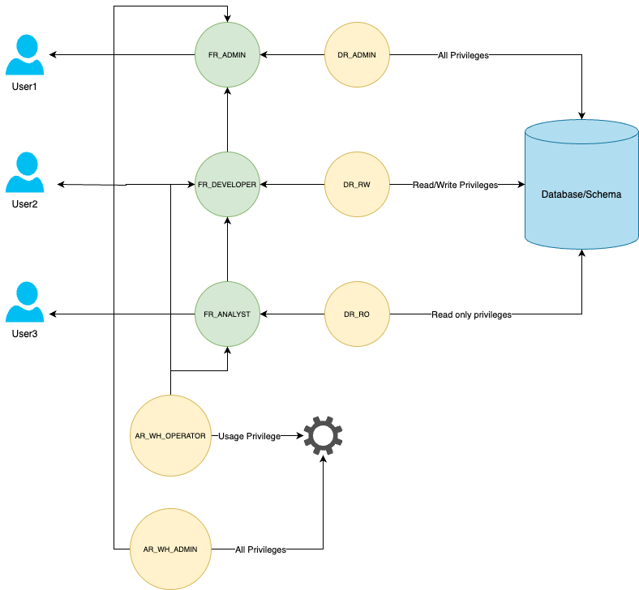

# Python utility for snowflake role design
This is a python utility which allows to create snowflake database,schema,warehouses,roles,privileges for snowflake. The ouput is generated in "op.sql" file, which can be directly on snowfalke worksheet.

# Overall Design of Roles

# Types of roles

### 1. DATABASE ROLES

These are roles which determine the type of access to database, schema and other snowfalke objects.

These roles are not assigned to snowfalke user directly, but assigned to a functional role.

Can be classifed further as 

- DR_ADMIN
    This role gets all privileges on database,schema and schmea objects. This is the most powerful role.
- DR_RW
    This role gives gets usage on database,schema and all privileges on schema objects. This is a read write role.
- DR_RO
    This role gives gets usage on database,schema and usage privileges on schema objects. This is a read only role.

### 2. FUNCTIONAL ROLES

These are roles which determine whether a user entity will be an admin, or an etl developer or an analyst. This role does not have any privileges by itself.

These roles are assigned to DATA ACCESS roles, and then this roles is assigned to user directly.

Can be classifed further as 

- FR_ADMIN
- FR_DEVELOPER
- FR_ANALYST

### 3. WAREHOUSE ROLES

Can be classifed further as 

- AR_WH_ADMIN
    This role gets all privileges on warehouse.
- AR_WH_OPERATOR
    This role gets usage privilege on warehouse.

## Requirements to run program

- Python3
- List is of dependencies are mentioned in instructions.txt

The program generates an output in .sql , which can be run as is in snowfalke

The input to program is mapping.yml, which has 
- Name of database to be created
- Name of schema to be created
- Name of roles and privileges to be assigned to each role
- Roles to be assigned to each user

## Prequistes

1. Python
2. Python libraries below

- pip3 install pandas  
- pip3 install snowflake-connector-python  
- pip3 install pyyaml  

## How to run program

- Create database,schemas,warehouses,roles,grants to roles and privileges  
python3 CreateDbSchemaRoles.py Create

- Delete database,warehouses,roles,grants to roles and privileges  
python3 CreateDbSchemaRoles.py Delete